

  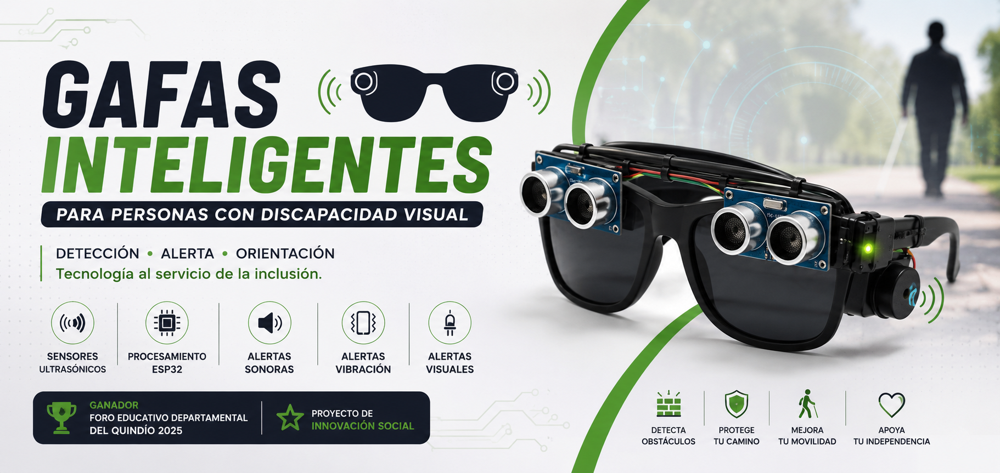

<h1 align="center">Gafas Inteligentes para Personas con Discapacidad Visual</h1>

<b>Sistema portátil de asistencia mediante sensores ultrasónicos y alertas multimodales desarrollado con ESP32.</b>

Proyecto de innovación social enfocado en mejorar la movilidad y la detección de obstáculos para personas con discapacidad visual mediante tecnología de bajo costo.

 

# 🏆 Reconocimientos

Este proyecto fue desarrollado como una propuesta de innovación tecnológica y social.

🏅 **Ganador del Foro Educativo Departamental del Quindío 2025**

🥇 Participante y ganador en diferentes ferias de ciencia e innovación.

👩‍🦯 Validado mediante pruebas funcionales con una persona con discapacidad visual.

 

# 📑 Índice

- 📖 Descripción
- 🎥 Video demostrativo
- ✨ Características
- ⚙️ Funcionamiento
- 🛠 Hardware
- 💻 Software
- 📊 Diagramas
- 📸 Galería
- 🚀 Instalación
- 📈 Resultados
- 🔮 Mejoras Futuras
- 👨‍💻 Autor

 

# 📖 Descripción

Las **Gafas Inteligentes para Personas con Discapacidad Visual** son un dispositivo electrónico portátil diseñado para asistir en la detección de obstáculos mediante sensores ultrasónicos.

El sistema analiza continuamente el entorno utilizando dos sensores HC-SR04 y genera diferentes tipos de alertas según la distancia detectada.

Estas alertas se transmiten mediante:

- 🔊 Sonido (Buzzer)
- 💡 Luz (LED)
- 📳 Vibración (Motor vibrador)

Todo el procesamiento es realizado por un **ESP32**, permitiendo una respuesta rápida y un bajo consumo energético.

 

# 🎥 Video demostrativo

<video width="640" height="360" controls>
  <source src="Presentación/Presentación.mp4" type="video/mp4">
  Tu navegador no soporta la etiqueta de video.
</video>

 

# ✨ Características

- 👓 Diseño portátil.
- 📡 Detección frontal mediante dos sensores ultrasónicos.
- ⚡ Procesamiento en tiempo real.
- 📳 Sistema de vibración.
- 🔊 Alertas sonoras.
- 💡 Alertas visuales.
- 🔋 Alimentación mediante batería recargable.
- 🧠 Procesamiento con ESP32.
- ♿ Enfocado en accesibilidad.

 

# ⚙️ Funcionamiento

El sistema ejecuta continuamente el siguiente proceso:

1. Los sensores detectan obstáculos.
2. El ESP32 calcula la distancia de ambos sensores.
3. Se selecciona la menor distancia.
4. Se determina el nivel de alerta.
5. Se activan los actuadores correspondientes.
6. El proceso vuelve a comenzar.

 

# 🚨 Niveles de alerta

| Distancia | Estado | Acciones |
|-----------|--------|----------|
| > 100 cm | 🟢 Sin alerta | Todo apagado |
| 30 - 100 cm | 🟡 Alerta Nivel 1 | LED + Buzzer lento |
| < 30 cm | 🔴 Alerta Nivel 2 | LED rápido + Vibración + Buzzer rápido |

 

# 🛠 Hardware

| Componente | Cantidad |
|------------|---------:|
| ESP32 | 1 |
| Sensor HC-SR04 | 2 |
| Buzzer | 1 |
| Motor Vibrador | 1 |
| LED | 1 |
| Batería 18650 | 1 |
| Módulo Step-Up 5V | 1 |
| Gafas | 1 |

 

# 💻 Software

| Tecnología | Uso |
|------------|-----|
| Arduino IDE | Programación |
| ESP32 | Microcontrolador |
| C++ | Desarrollo |
| HC-SR04 | Sensado |
| PWM | Control del buzzer |

 

# 📊 Diagramas

## Funcionamiento General

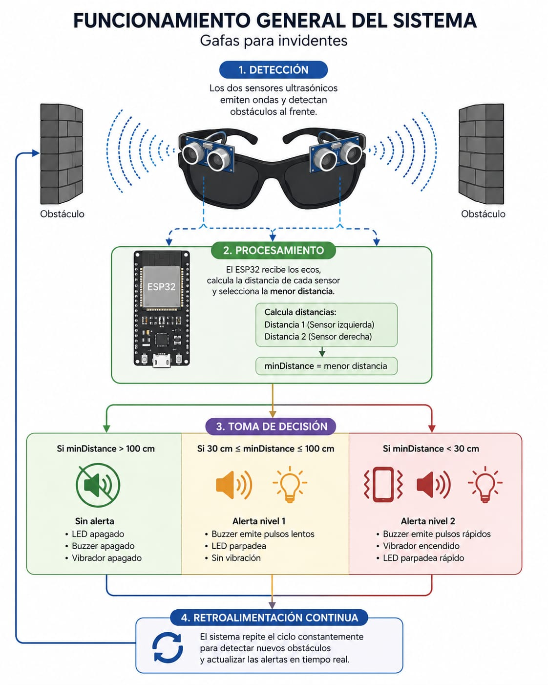

 

## Diagrama de Flujo

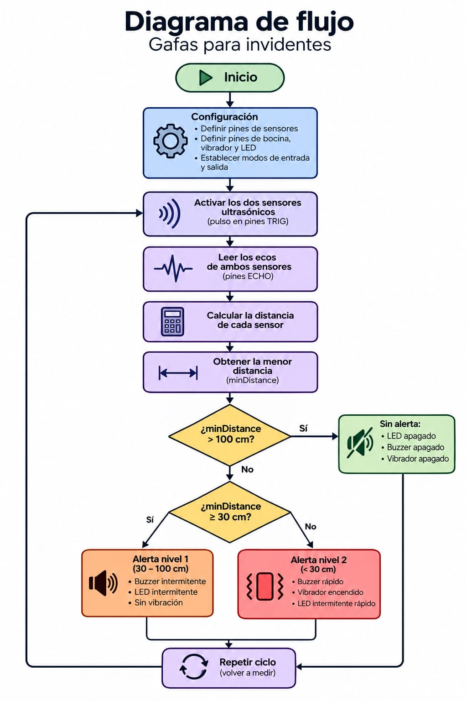

 

## Diagrama de Conexiones

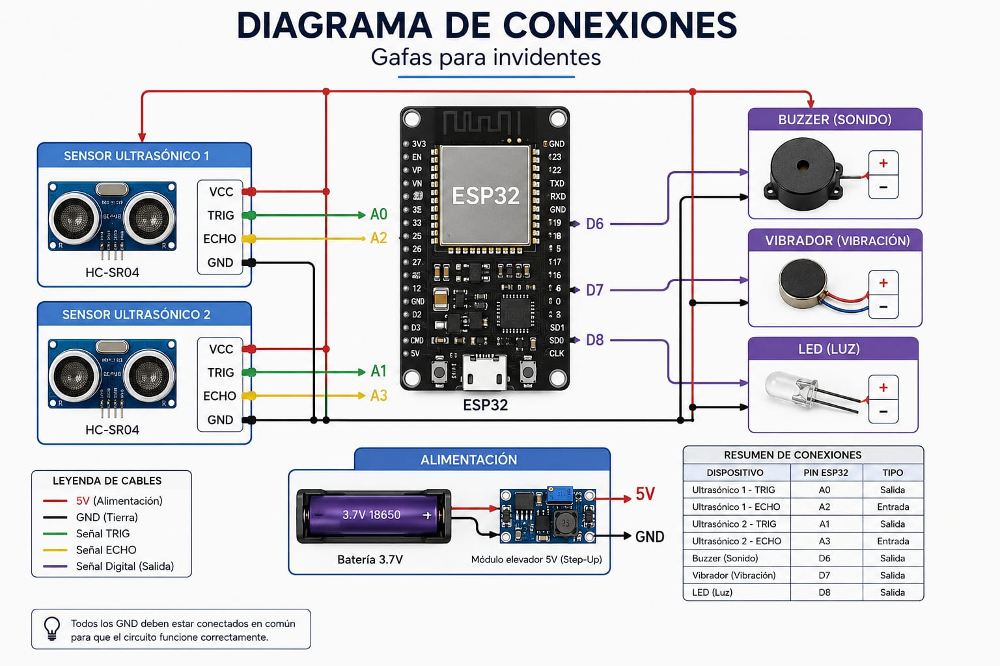

 

# 📸 Galería

## Desarrollo

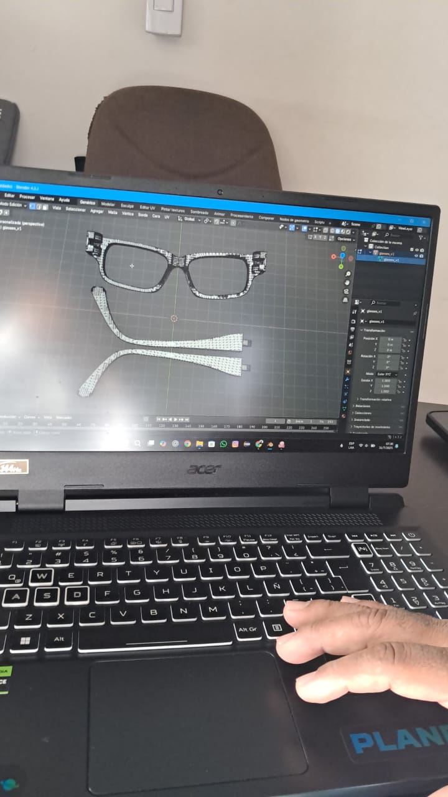
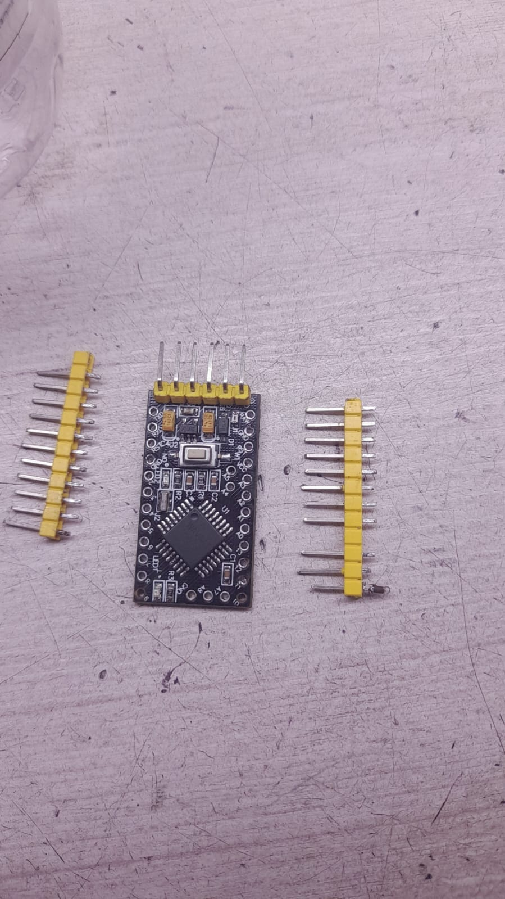

 

## Prototipo

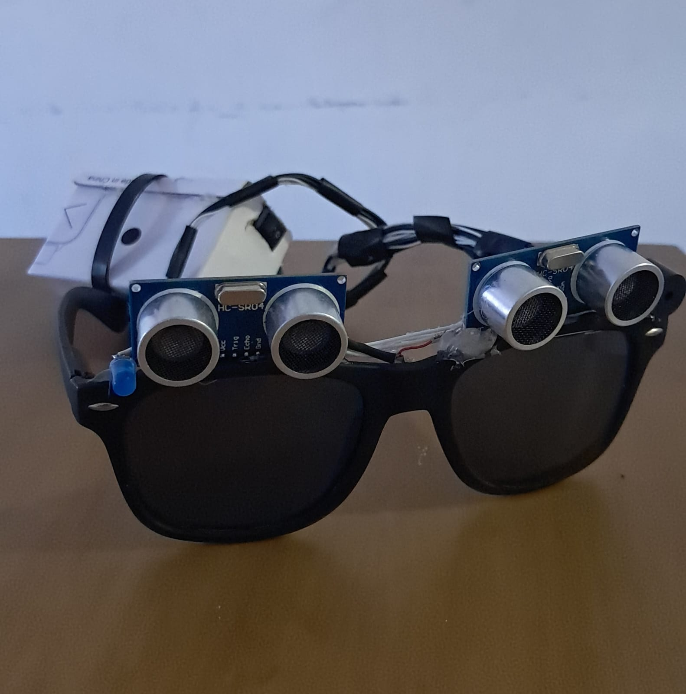
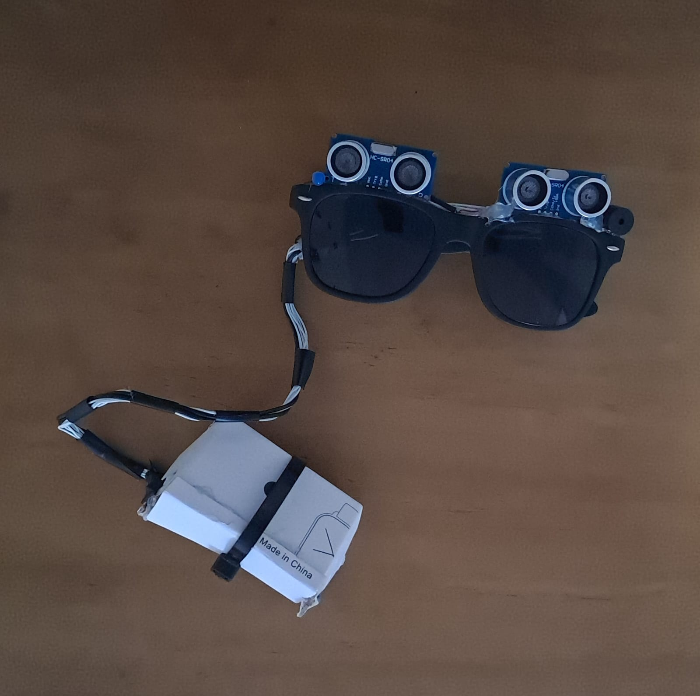

 

## Validación

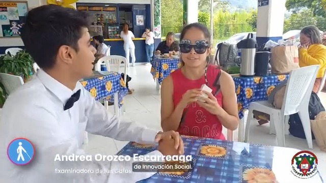

 

## Presentaciones

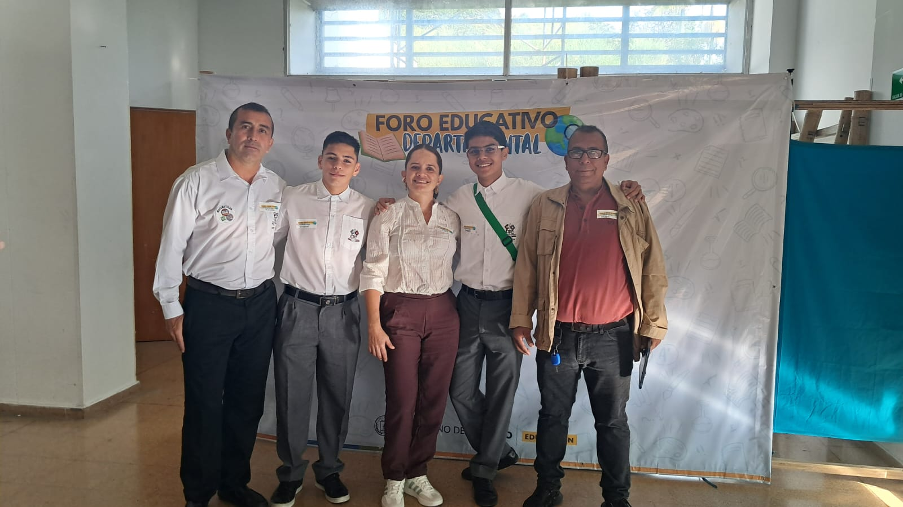
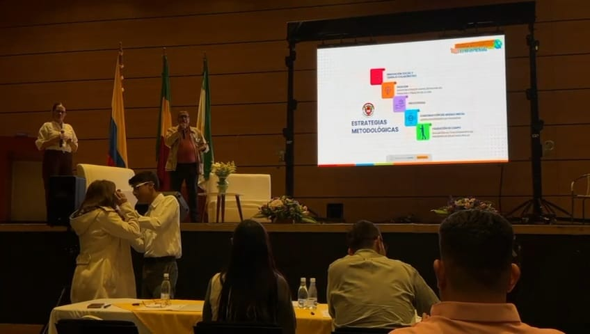
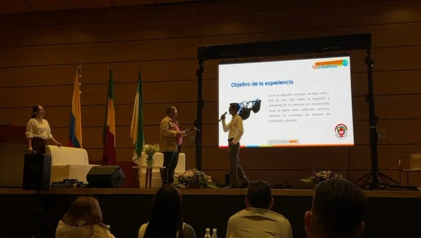
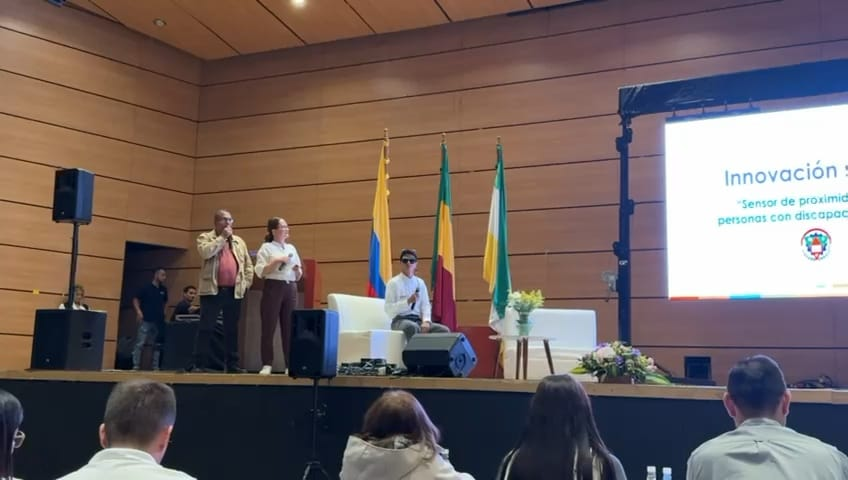 

_Más muestras en el directorio_

 

# 🚀 Instalación

## Hardware

1. Conectar los sensores ultrasónicos.
2. Conectar el buzzer.
3. Conectar el vibrador.
4. Conectar el LED.
5. Alimentar el sistema mediante batería.

 

## Software

1. Instalar Arduino IDE.
2. Instalar soporte para ESP32.
3. Abrir el proyecto.
4. Seleccionar la placa ESP32.
5. Compilar y cargar el programa.

 

# 📈 Resultados

| Resultado | Estado |
|-----------|:------:|
| Detección de obstáculos | ✅ |
| Procesamiento en tiempo real | ✅ |
| Alerta sonora | ✅ |
| Alerta visual | ✅ |
| Vibración | ✅ |
| Validación funcional | ✅ |
| Presentación pública | ✅ |
| Premio departamental | 🏆 |

 

# 🔮 Mejoras Futuras

- 📷 Integración con cámara IA.
- 🧠 Detección mediante visión artificial.
- 📱 Aplicación móvil.
- 📍 GPS integrado.
- 🗣 Navegación por voz.
- ☁ Sincronización con servicios en la nube.

 

# 📄 Licencia

Este proyecto fue desarrollado con fines educativos, de investigación e innovación social.

 

# 👨‍💻 Autor

**Samuel Durán Cárdenas**

Desarrollador de Software • Electrónica • Videojuegos • Innovación Tecnológica

<b>💙 Tecnología al servicio de la inclusión.</b>
⭐ Si este proyecto te pareció interesante, considera apoyar el repositorio con una estrella.

